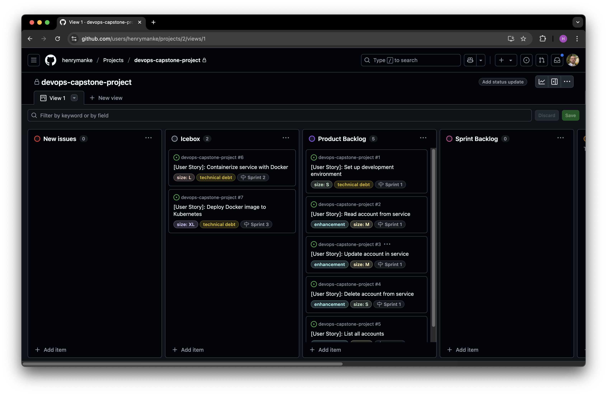

# 🛠 Agile Planning Setup

This document outlines the general Agile planning setup for software projects using GitHub. It describes how to prepare and manage an Agile workflow using best practices inspired by Scrum methodology, including backlog creation, issue templating, sprint organization, and estimation.

---

## ✅ Objectives

- Set up a GitHub repository and project board
- Define reusable user story templates
- Create and prioritize backlog items
- Assign story points and organize sprints
- Track progress using Kanban-style workflows

---

## 📁 Repository & Board Setup

1. **Create a GitHub repository** (public or private).
2. **Enable GitHub Projects** (classic or Beta).
3. **Configure a Kanban board** with the following columns:

    New Issues → Icebox → Product Backlog → Sprint Backlog → In Progress → Review/QA → Done

4. Use **Issues** to track all work items (features, bugs, chores).

---

## 🧩 User Story Template

Create a reusable user story template to ensure consistency across issues.

📂 Path: `.github/ISSUE_TEMPLATE/user-story.md`

```md
---
name: User Story
about: Standard user story format using Gherkin syntax
title: "[User Story]: "
labels: enhancement
assignees: []
---

**As a** [role]  
**I need** [goal]  
**So that** [benefit]  

### Details and Assumptions
* [List relevant notes or conditions]

### Acceptance Criteria  
**Given** [some context]  
**When** [action is taken]  
**Then** [expected result occurs]
```

> This ensures stories follow the format: *As a \[user], I need \[feature], so that \[benefit]*.

---

## 🧱 Backlog Management

### 🎯 Product Backlog

- Add all upcoming work items as user stories.
- Include clear **descriptions** and **acceptance criteria**.
- Assign appropriate **labels** (e.g., `enhancement`, `bug`, `technical debt`).

### 📥 Icebox

- Use the `Icebox` column for low-priority or future ideas.

### 🎯 Labels Example

| Label            | Purpose                                 |
| ---------------- | --------------------------------------- |
| `enhancement`    | Adds visible value for the user         |
| `bug`            | Fixes broken or incorrect behavior      |
| `technical debt` | Internal task with no user-facing value |
| `size: S`        | Small (3 story points)                  |
| `size: M`        | Medium (5 story points)                 |
| `size: L`        | Large (8 story points)                  |
| `size: XL`       | Very large (13 story points)            |

---

## 🧮 Estimating Story Points

- Use a **relative scale** (commonly Fibonacci: 3, 5, 8, 13).
- Assign points based on effort, complexity, and uncertainty.
- Add points using:

  - A `size:` label, or
  - Inline in the issue title or body

---

## 🗓 Sprint Planning

If your team follows sprints:

- Define 1- or 2-week sprints using:

  - **Milestones** (recommended in GitHub)
    - `Project > Issues > Milestones > New Milestone`
  - Or `sprint:` labels
- Assign issues to milestones (e.g., `Sprint 1`)
- Move issues from `Product Backlog` → `Sprint Backlog`
- During the sprint:

  - Move issues to `In Progress`, then `Review/QA`, then `Done`

---

## 📊 Tracking Progress

- Use the Kanban board to track flow and status.
- Use milestones to track sprint burndown and completion.
- Optionally use third-party tools (e.g., Zenhub, Jira, Linear) for advanced sprint features.

---

## 🧾 Sample Board



---

## 🔗 Resources

- [Scrum Guide](https://scrumguides.org/)
- [GitHub Projects Docs](https://docs.github.com/en/issues/planning-and-tracking-with-projects)
- [GitHub Issue Templates](https://docs.github.com/en/communities/using-templates-to-encourage-useful-issues-and-pull-requests)

---

## 📦 Recommended File Structure

```tree
.
├── .github/
│   └── ISSUE_TEMPLATE/
│       └── user-story.md
└── README.md
```

---

This document is designed to be reusable across projects to ensure consistent Agile planning and delivery practices using GitHub.
